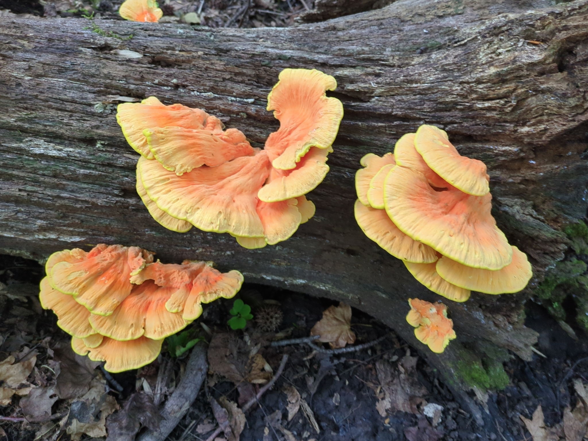
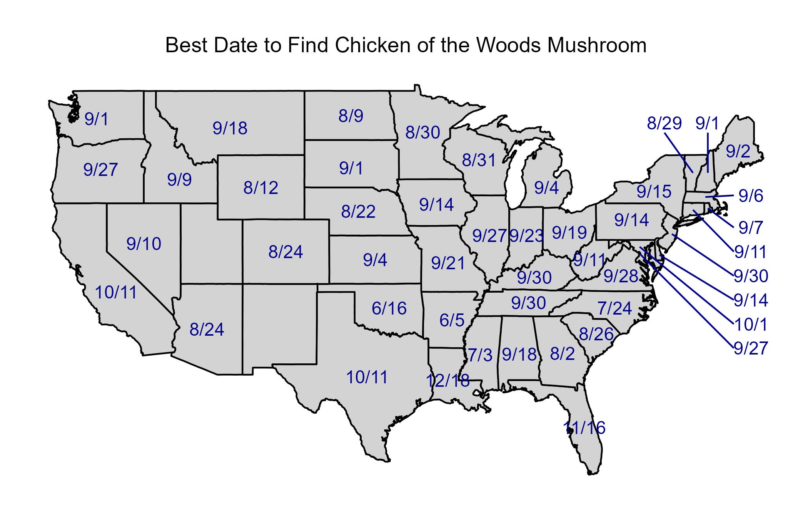

# Best Date to Find Chicken of the Woods Mushroom!
## Table of Contents
- [Introduction](#introduction)
- [Results](#results)
- [Data Sets](#data-sets)
- [Analytic Files](#analytic-files)
- [References](#References)

## Introduction

The above photo was taken by me earlier in 2024 in Rockland County New York, United States. This project helps determine the date with the highest expected number of Chicken of the Woods observations among states with prior observation records on iNaturalist.

**DISCLAIMER:** Consuming wild mushrooms, plants or other material is inherently risky for health reasons as well as potentially damaging to local ecosystems. Please do not consume anything you are not 100% confident identifying and be respectful, follow local regulations and  sustainable harvesting practices if you do chose to forage (e.g., don't take something if it is the only one, don't take more than you need, get permission to harvest on private property, etc.).

**Background:** An estimated 3.5 to 5.8 billion people collect non-timber forest products globally, this includes harvesting wild herbs, fruits, fungi, and more [[1](https://doi.org/10.1016/j.forpol.2021.102659)]. 

Approximately 1-in-4 people surveyed within the New England region of the United States of America, reported harvesting some non-timber forest products within the past 5 years [[2](https://doi.org/10.1111/j.1475-4762.2008.00794.x)].

This analysis focuses on *Laetiporus*, a genus of edible mushrooms that decompose dead wood and are found around the world. This genus of fungi is better known by its common name, 'chicken of the woods' due to its distinct flavor and texture which resembles chicken.

**Problem:** Newer foragers, or seasoned foragers who have not encountered a chicken of the woods mushroom may not know when the best time to look for these iconic mushrooms.

**Objective:** Leverage generalized additive models (GAMs) to help estimate the best day of the year to find a chicken of the woods mushroom in a particular region using available historic data.

[Back to top](#best-date-to-find-chicken-of-the-woods-mushroom)

## Results

The above graphic plots the date estimated to have the most Chicken of the Woods observations based on aggregated observations between January 1st, 2010 and December 31st, 2023.

The animated graphic above helps to visualize all observations of Chicken of the Woods mushrooms made between January 1st, 2010 and December 31st, 2023 based on the week of the year they were observed.

For those interested in seeing the distribution of observations within their own state there is code available to check the individual state shared within the R Markdown file, and I've provided each state grouped by region to help illustrate trends. It is important to note that plots within a region have identical y-axis scales, and therefore states with a greater population or other factors that may contribute to having more observations may obscure trends for states with relatively fewer observations.

**Northeast United States**

**Midwest United States**

**Southern United States**

**Western United States**

**Alaska and Hawaii**

[Back to top](#best-date-to-find-chicken-of-the-woods-mushroom)

## Data Sets
* **L_cincinnatus_observations.csv**: Observations of *Laetiporus cincinnatus* in the United States occuring prior to January 1st, 2024, queried from iNaturalist.
* **L_conifericola_observations.csv**: Observations of *L. conifericola* in the United States occuring prior to January 1st, 2024, queried from iNaturalist.
* **L_gilbertsonii_observations.csv**: Observations of *L. gilbertsonii* in the United States occuring prior to January 1st, 2024, queried from iNaturalist.
* **L_sulphureus_observations.csv**: Observations of *L. sulphureus* in the United States occuring prior to January 1st, 2024, queried from iNaturalist.
  * For a complete description of all the variables included visit [iNaturalist's](https://www.inaturalist.org/home) download options. Otherwise, variables of interest that were used in this analysis are described within the R Markdown file described below.

[Back to top](#best-date-to-find-chicken-of-the-woods-mushroom)

## Analytic Files:
**Chicken_of_the_Woods_Analysis.Rmd**: The R Markdown file containing all the code to reproduce the results in the analysis.

[Back to top](#best-date-to-find-chicken-of-the-woods-mushroom)

## References
1. Shackleton, C. M., & de Vos, A. (2022). How many people globally actually use non-timber forest products?. Forest Policy and Economics, 135, 102659. https://doi.org/10.1016/j.forpol.2021.102659

2. Robbins, P., Emery, M., & Rice, J. L. (2008). Gathering in Thoreau's backyard: nontimber forest product harvesting as practice. Area, 40(2), 265-277. https://doi.org/10.1111/j.1475-4762.2008.00794.x

[Back to top](#best-date-to-find-chicken-of-the-woods-mushroom)
